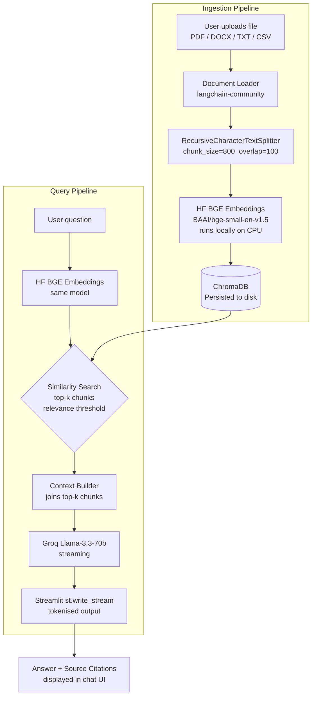

# DocuChat - Multi-Format Document RAG Chatbot

> **Chat with any document - PDFs, Word files, CSVs, and plain text - with source citations on every answer.**

[](https://your-app.streamlit.app)
[](https://python.org)
[](https://langchain.com)
[](LICENSE)

---

## 📸 Demo


---

## What It Does

- Ingests multi-format documents (PDF, DOCX, TXT, CSV, Markdown)
- Builds a persistent local vector index with embeddings
- Retrieves the most relevant chunks for each user question
- Streams grounded answers with source citations in the chat UI

---

## ✨ Features

- **Multi-format ingestion** - PDF, DOCX, TXT, CSV, Markdown
- **Semantic search** - BAAI/bge-small-en-v1.5 embeddings (outperforms OpenAI ada-002, runs locally for free)
- **Streaming answers** - token-by-token output via Groq Llama-3.3-70b
- **Source citations** - every answer links back to the exact document chunk with a relevance score
- **Adjustable retrieval** - tune `k` (chunk count) and relevance threshold from the sidebar
- **Persistent vector store** - ChromaDB persisted to disk; survives app restarts
- **One-click deploy** - Streamlit Community Cloud with zero configuration

---

## Architecture



## Outcome

- Reduces time spent manually searching long documents
- Improves trust with chunk-level source citations for every answer
- Creates a reusable personal or team knowledge assistant from mixed file formats

---

## 🛠 Tech Stack

| Layer | Technology |
|---|---|
| UI | Streamlit 1.35+ |
| Orchestration | LangChain 0.3 |
| Embeddings | HuggingFace `BAAI/bge-small-en-v1.5` (local, free) |
| Vector store | ChromaDB (embedded, persisted to disk) |
| LLM | Groq `llama-3.3-70b-versatile` (free tier) |
| Document parsing | PyPDF, Docx2txt, UnstructuredMarkdownLoader |
| Package manager | UV |
| Hosting | Streamlit Community Cloud (free) |

---

## 🚀 Getting Started

### Prerequisites

- Python 3.11+
- [UV](https://docs.astral.sh/uv/) installed
- A free [Groq API key](https://console.groq.com)

### Installation

```bash
# 1. Clone the repo
git clone https://github.com/your-username/docuchat-rag.git
cd docuchat-rag

# 2. Install dependencies with UV
uv sync

# 3. Set up environment variables
cp .env.example .env
# Edit .env and add your GROQ_API_KEY
```

### Run locally

```bash
uv run streamlit run app.py
```

Open [http://localhost:8501](http://localhost:8501) in your browser.

---

## 📁 Project Structure

```
docuchat-rag/
├── app.py                  # Streamlit UI - upload, chat, citations
├── services/
│   ├── __init__.py
│   ├── embeddings.py       # HF BGE-small model (cached singleton)
│   ├── ingestion.py        # File loading, chunking, storing
│   ├── vectorstore.py      # ChromaDB CRUD + similarity search
│   └── llm.py              # Groq streaming wrapper
├── .streamlit/
│   └── config.toml         # Dark theme + upload size limit
├── pyproject.toml          # UV dependencies
├── uv.lock                 # Pinned lockfile
├── .env.example            # Environment variable template
└── README.md
```

---

## ⚙️ Environment Variables

| Variable | Required | Description |
|---|---|---|
| `GROQ_API_KEY` | ✅ | Groq API key - get one free at console.groq.com |
| `HF_TOKEN` | ❌ | Only needed if you switch to HF Inference API for embeddings |
| `CHROMA_PERSIST_DIR` | ❌ | Override ChromaDB storage path (default: `./chroma_db`) |

---

## 🧠 How It Works

### 1. Document Ingestion
When you upload a file and click **Process**:
1. The file is written to a temporary path and loaded by the appropriate LangChain loader.
2. `RecursiveCharacterTextSplitter` splits the text into 800-token chunks with 100-token overlap to preserve context at boundaries.
3. Each chunk is embedded using `BAAI/bge-small-en-v1.5` running locally on CPU.
4. Embeddings and metadata (filename, chunk index) are stored in ChromaDB.

### 2. Query & Answer
When you ask a question:
1. The question is embedded with the same BGE model.
2. ChromaDB performs a cosine similarity search, returning the top-k most relevant chunks above the relevance threshold.
3. The retrieved chunks are concatenated into a context string.
4. Groq Llama-3.3-70b receives a system prompt + context + question, and streams back a grounded answer.
5. Source chunks are displayed below the answer with file name and relevance score.

---

## 🚢 Deploy to Streamlit Community Cloud

1. Push this repo to GitHub.
2. Go to [share.streamlit.io](https://share.streamlit.io) → **New app**.
3. Select your repo, set `app.py` as the entry point.
4. Add `GROQ_API_KEY` under **Secrets**.
5. Click **Deploy** - done. Streamlit Cloud auto-detects `pyproject.toml` and runs `uv sync`.

---

## 📄 License

MIT - see [LICENSE](LICENSE).

---

## Logging

- Python logging is configured at app startup.
- Set `LOG_LEVEL` to control verbosity (`INFO` by default).
